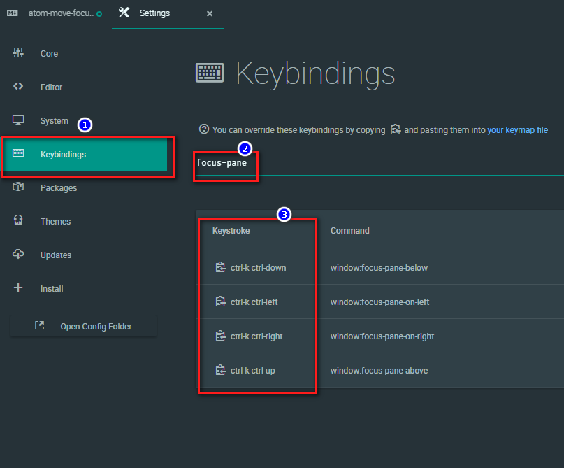

# Atom - Move Focus Between Panes

## Solution
`Ctrl + K, Ctrl + <Arrow Keys>`

or check in `Settings` > `Keybindings` > Search for `focus-pane`

## Reference
https://github.com/atom/atom/issues/2670#issuecomment-258660394
