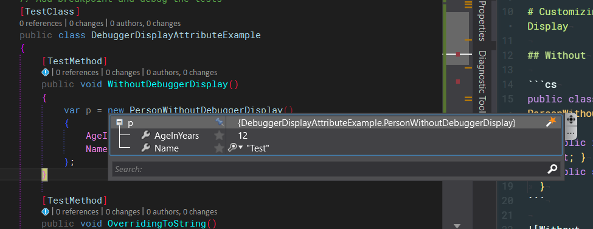
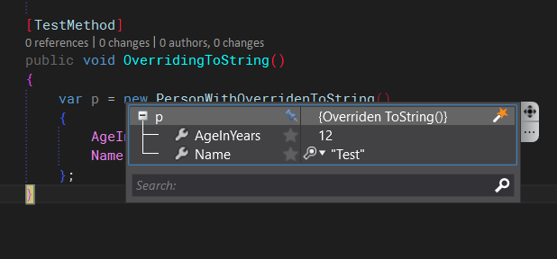
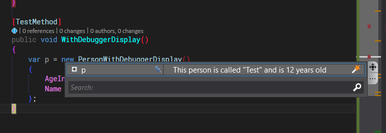

# Customizing Output in Debugger Display

## Without

```cs
public class PersonWithoutDebuggerDisplay
	{
		public int AgeInYears { get; set; }
		public string Name { get; set; }
	}
```


## Overriding .ToString()

```cs
public class PersonWithOverridenToString
	{
		public int AgeInYears { get; set; }
		public string Name { get; set; }

		public override string ToString()
		{
			return "Overriden ToString()";
		}
	}

```


## Using DebuggerDisplay
```cs
[DebuggerDisplay("This person is called {Name} and is {AgeInYears} years old")]
	public class PersonWithDebuggerDisplay
	{
		[DebuggerDisplay("{AgeInYears} years old")]
		public int AgeInYears { get; set; }

		[DebuggerDisplay("Hello {Name}")]
		public string Name { get; set; }
	}
```
> Refer to member by enclosing them in curly braces `{AgeInYears}`




> Note: DebuggerDisplayAttribute on property is not working due to a [ bug in Visual Studo](https://github.com/dotnet/roslyn/issues/4134)

# See Also
[DebuggerDisplay attribute best practices](https://blogs.msdn.microsoft.com/jaredpar/2011/03/18/debuggerdisplay-attribute-best-practices/)

[OzCode](http://www.oz-code.com/)

# Full Code
```cs
using System.Diagnostics;
using Microsoft.VisualStudio.TestTools.UnitTesting;

namespace DebuggerDisplayAttributeExample
{
	// Add breakpoint and debug the tests
	[TestClass]
    public class DebuggerDisplayAttributeExample
	{
		[TestMethod]
		public void WithoutDebuggerDisplay()
		{
			var p = new PersonWithoutDebuggerDisplay()
			{
				AgeInYears = 12,
				Name = "Test"
			};
		}

		[TestMethod]
		public void OverridingToString()
		{
			var p = new PersonWithOverridenToString()
			{
				AgeInYears = 12,
				Name = "Test"
			};
		}

		[TestMethod]
		public void WithDebuggerDisplay()
		{
			var p = new PersonWithDebuggerDisplay()
			{
				AgeInYears = 12,
				Name = "Test"
			};
		}
	}

	public class PersonWithoutDebuggerDisplay
	{
		public int AgeInYears { get; set; }
		public string Name { get; set; }
	}

	public class PersonWithOverridenToString
	{
		public int AgeInYears { get; set; }
		public string Name { get; set; }

		public override string ToString()
		{
			return "Overriden ToString()";
		}
	}

	[DebuggerDisplay("This person is called {Name} and is {AgeInYears} years old")]
	public class PersonWithDebuggerDisplay
	{
		[DebuggerDisplay("{AgeInYears} years old")]
		public int AgeInYears { get; set; }

		[DebuggerDisplay("Hello {Name}")]
		public string Name { get; set; }
	}

}


```
