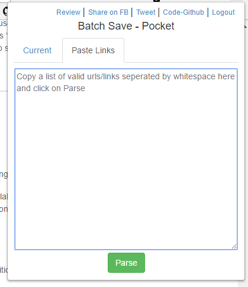

# Batch Save Pocket - Import Multiple Links to Pocket
## Problem
[Pocket](https://getpocket.com/) does not support importing multiple links at once.

## Solution
Use [Batch Save Pocket](https://chrome.google.com/webstore/detail/batch-save-pocket/ihhiomekhplpdojbcaniaglcfopckaef/related?hl=en).

## Side Note
The bookmarking tool that I had been using, [Stash.ai](https://stash.ai/), is now a paid product; thus I have to export all the bookmarks to [Pocket](https://getpocket.com/) (as I can't afford the subscription fee... 😭)

A neat feature of Stash.ai is that it can set reminders for stashed link, or "Read It Later"; Pocket is not going to support this (Reference: Under the section "[Reminders to Read/Watch](https://help.getpocket.com/article/1063-pockets-top-feature-requests)"). I am using [Todoist](https://todoist.com/) as a "replacement" for this feature. It's [Chrome Extensions](https://chrome.google.com/webstore/detail/todoist-to-do-list-and-ta/jldhpllghnbhlbpcmnajkpdmadaolakh) can add website as task.

Export all links in Stash.ai as TXT and import it via the chrome extension into Pocket.

## Reference
SO: [Import multiple URLs to Pocket (or Instapaper)](https://stackoverflow.com/a/23986958)
