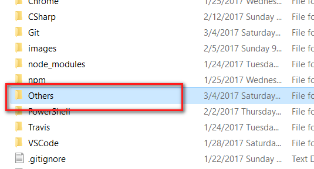
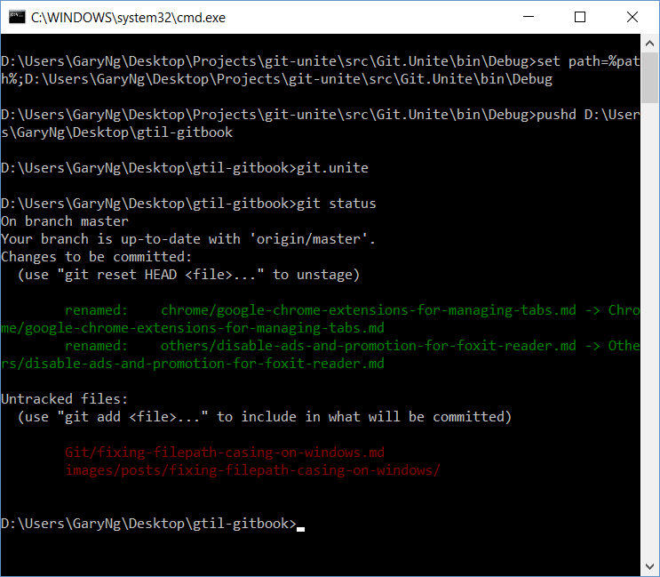

# Fixing Filepath Casing on Windows
## Problem
Just found this weird problem on my GitBook (Built by Travis):  
  

Turn out that on GitHub, there are two folders: `Others` and `others` (different casing)  

But it shows as one folder on my Windows machine:

## Solution
Some Googling brought me to this post [Git Unite – Fix Case Sensitive File Paths on Windows](http://www.woodcp.com/2013/01/git-unite-fix-case-sensitive-file-paths-on-windows/)
> Since Windows is **not case sensitive**, the git index case sensitivity issue does not manifest itself until browsing the code repository on GitHub or cloning the repository to a case sensitive file system on Linux.

Using the tool [Git.Unite](https://github.com/tawman/git-unite) solved the problem:  

# Reference
[Git Unite – Fix Case Sensitive File Paths on Windows](http://www.woodcp.com/2013/01/git-unite-fix-case-sensitive-file-paths-on-windows/)  
[Git.Unite on GitHub](https://github.com/tawman/git-unite)
