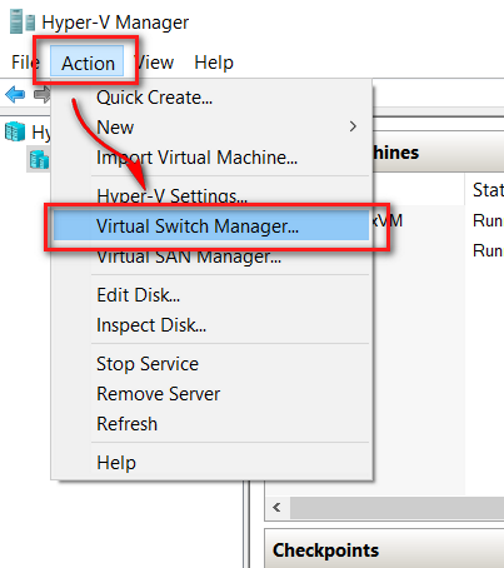
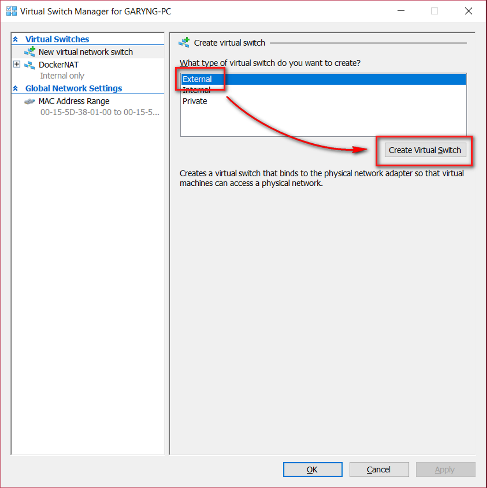
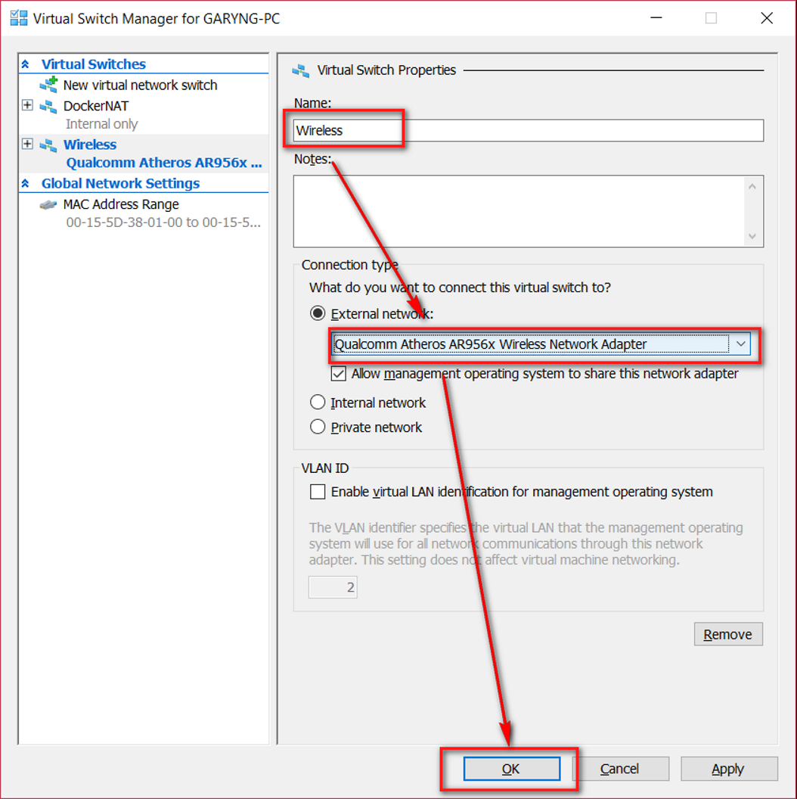
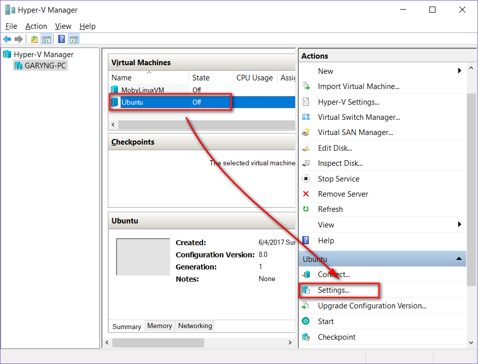
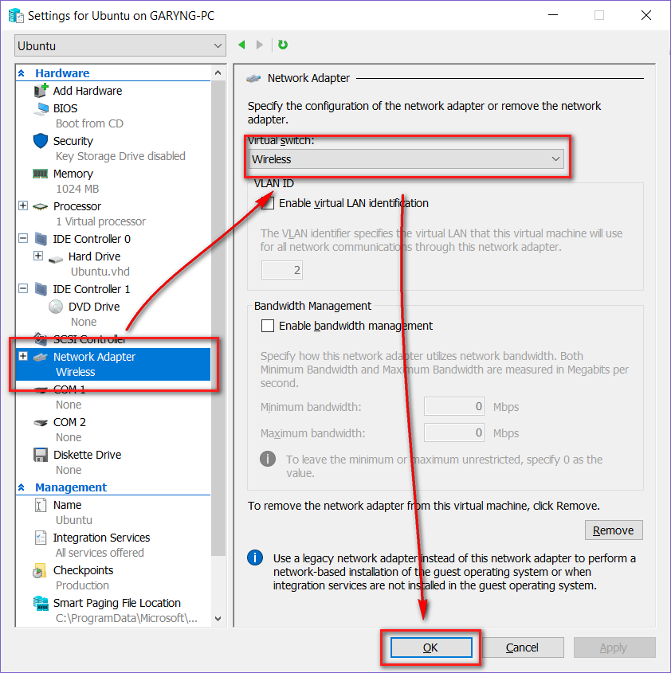

# Give HyperV VM Internet Access
## Solution
### Creating a New Virtual Swtich
1. Open Hyper-V Manager
2. Goto Action > Virtual Switch Manager...  

3. Select External > Create Virtual Switch  

4. Name the switch > select the correct network card (which is connected to the Internet) > Click OK  
	

### Configuring the Virtual Machine
1. Choose the virtual machine > Settings  

2. Goto Network Adapter > Select the created virtual switch > OK  

## Reference
[Windows 8 Hyper-V - how to give VM internet access?](https://superuser.com/questions/469806/windows-8-hyper-v-how-to-give-vm-internet-access)
