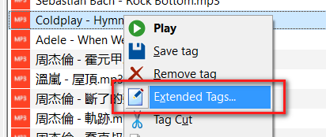
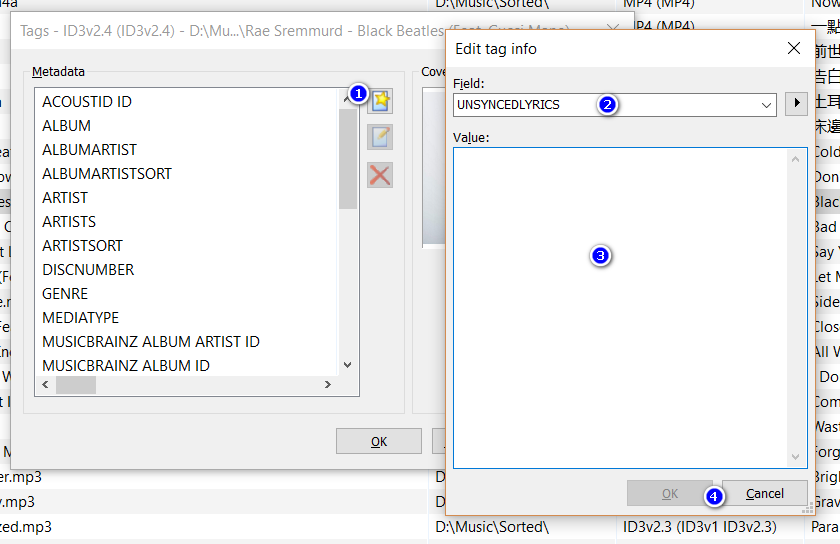
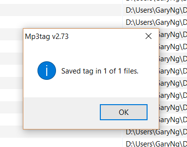

# Adding UNSYNCEDLYRICS with MP3Tag

1. Launch MP3Tag
2. Right click on MP3 > `Extended Tag...`  

3. `Add field...` > `UNSYNCEDLYRICS`  

4. Click `OK` > `OK` > `OK`  


> Alternatively, you can use [MusicBrainz Picard](https://picard.musicbrainz.org/) to auto tag MP3 files

## Lyrics Source
[魔镜歌词网](https://mojim.com/cnznew.htm)
> Regex for extracting `UNSYNCEDLYRICS` lyrics from mojim.com (paste into `Google Developer Console`)
> ```js
copy($('#fsZx1').innerText.replace(/(.*魔镜歌词网\s?\n)|(\n(感谢|友站连结).*)|(\[(\d+(:|.)?){1,3}.*\n)|(\n{3,})/g ,'').trim());
```
> lyrcs will be copied to the clipboard

## Reference
[用Mp3tag為您的MP3音樂檔修改標籤或加入註釋、封面及歌詞，安裝與教學篇。](http://blog.xuite.net/axian/blog/193080931-%E7%94%A8Mp3tag%E7%82%BA%E6%82%A8%E7%9A%84MP3%E9%9F%B3%E6%A8%82%E6%AA%94%E4%BF%AE%E6%94%B9%E6%A8%99%E7%B1%A4%E6%88%96%E5%8A%A0%E5%85%A5%E8%A8%BB%E9%87%8B%E3%80%81%E5%B0%81%E9%9D%A2%E5%8F%8A%E6%AD%8C%E8%A9%9E%EF%BC%8C%E5%AE%89%E8%A3%9D%E8%88%87%E6%95%99%E5%AD%B8%E7%AF%87%E3%80%82)
