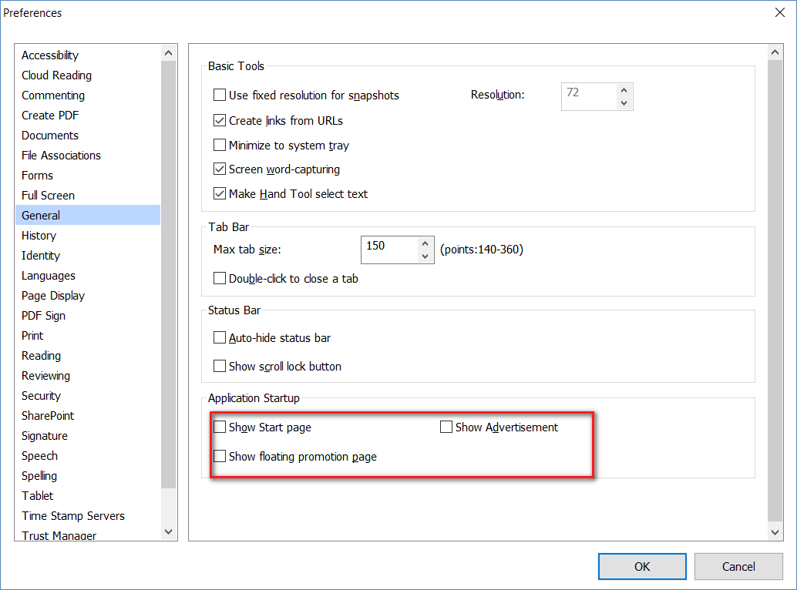

# Disable Ads and Promotion for Foxit Reader
Goto `File > Reference` under `General > Application Startup` section uncheck all:  
- Show Start Page
- Show Advertisement
- Show floating promotion page

