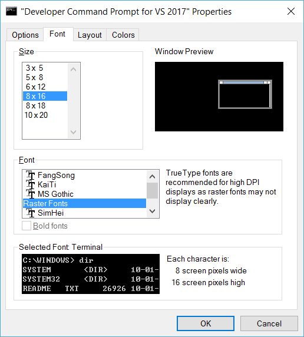
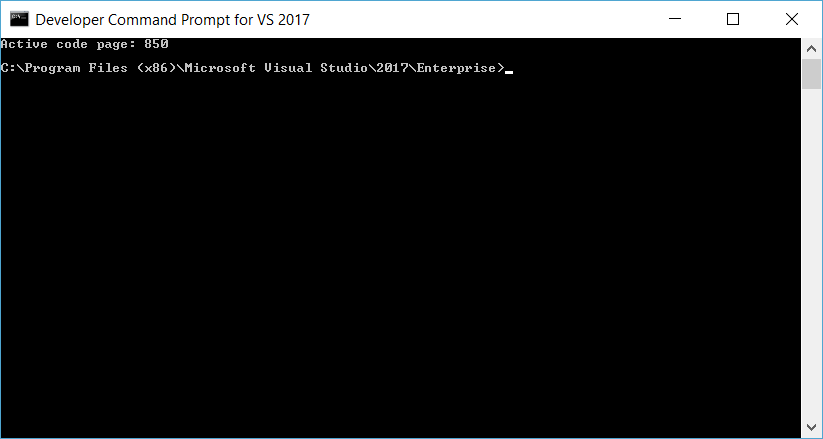
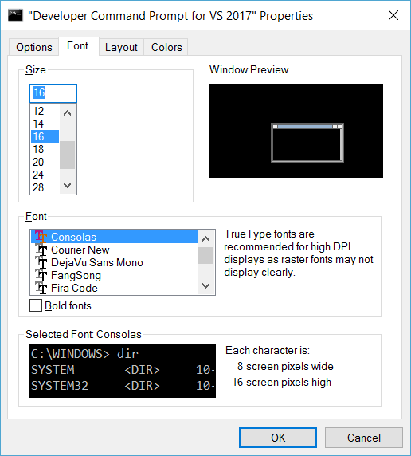
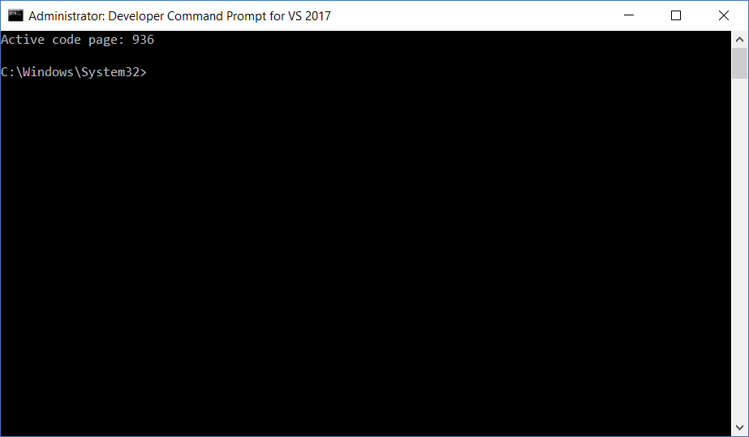

# Using Consolas Font in CMD
> Using `Developer Command Prompt for VS2017` as an example  
> Remember to start it as **Administrator**

## Adding Consolas font to Regedit
Open `regedit`

Goto `HKLM\Software\Microsoft\Windows NT\CurrentVersion\Console\TrueTypeFont`

Add a `REG_SZ` entry with the following contents:  
Name = `00`  
Value = `Consolas`


> NOTE: if there is already an entry for “00” you don’t need to change it. Simply  use “000” instead.

> Value has
to match the font name as seen at the following registry key:  
`HKLM\Software\Microsoft\Windows NT\CurrentVersion\Fonts`

[Optional] Log out and log in again / Restart

## Changing CMD's Fonts
Just go to Properties > Font and select `Consolas`

If `Consolas` is not found:   


Change code page to `850` or `65001`:
```bash
chcp 850
```


Try again



Change code page back to `936` (or whatever it is originally)
```bash
chcp 936
```


## Error Updating Shortcut


Solution: Restart command promt as **Administrator** and retry

# Reference
[Using Meslo LG with the Windows Console](https://github.com/andreberg/Meslo-Font/wiki/Using-Meslo-LG-with-the-Windows-Console)
