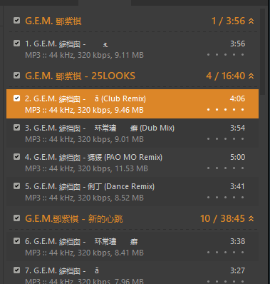
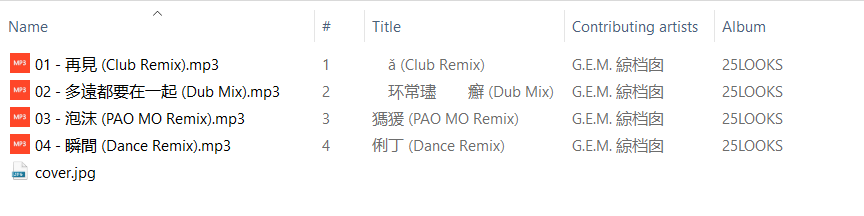
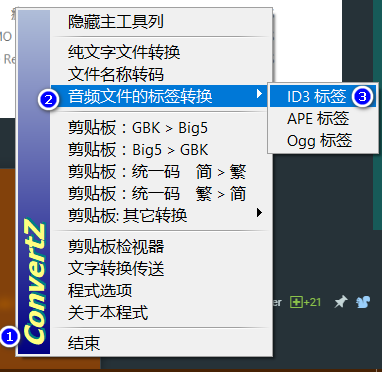
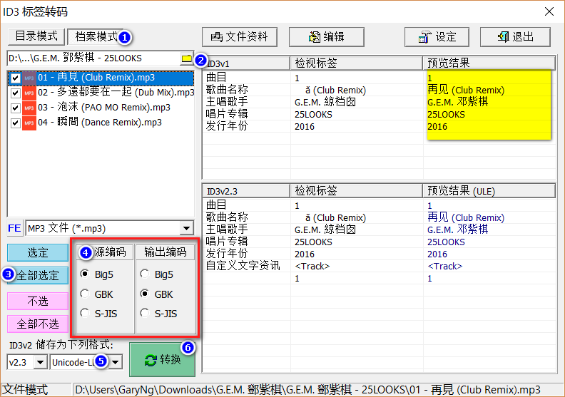
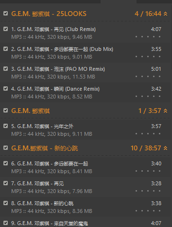
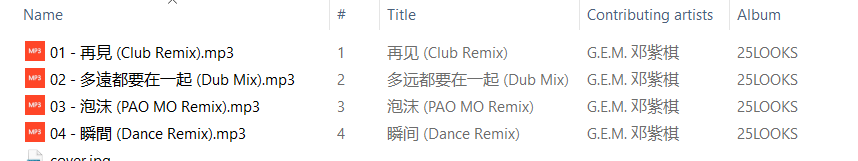
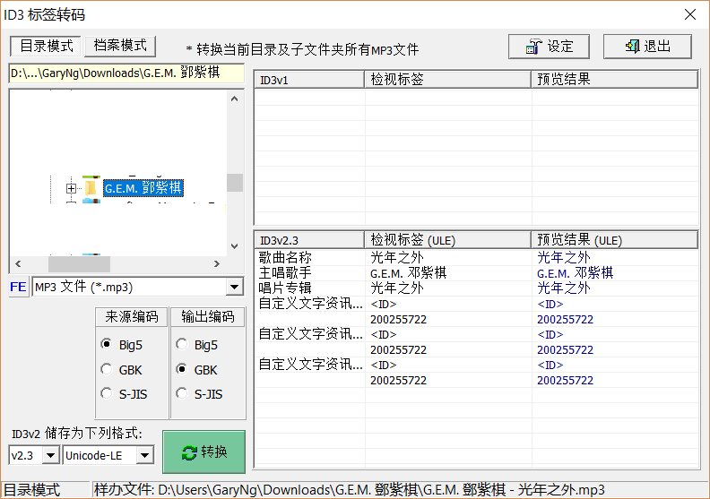

# 以ConvertZ 解决MP3 乱码问题

## Problem

## Solution
1. 下载ConvertZ ([MEGA](https://mega.nz/#!nVZhgI4K!PE59beyaVxBmZyNZTu47btsrPcAe1myCv_jlunGcy9U))
2. 运行ConvertZ
3. 左键点击ConvertZ 图标 > `音频文件的标签转换` > `ID3标签`  

4. 点击`档案模式` > 选择目录 > `全部选定` > 选择来源编码和输出编码（确保`预览结果`没有乱码） > 保存格式选择`Unicode LE` > 点击`转换`  

5. 完成  
  

> 也可以使用`目录模式`  
> 

## Reference
[中文簡繁內碼轉換器《ConvertZ》可解決MP3 ID3標籤亂碼問題](https://steachs.com/archives/1899)
