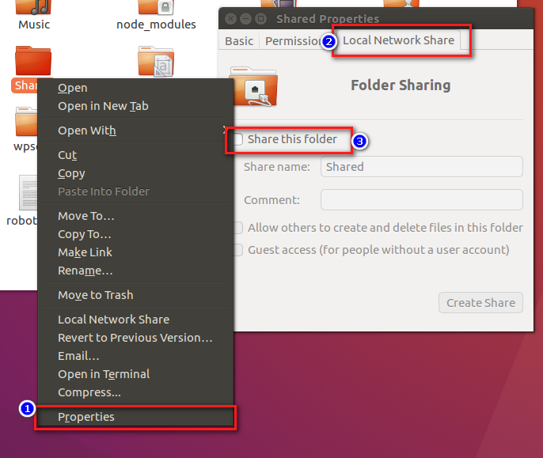
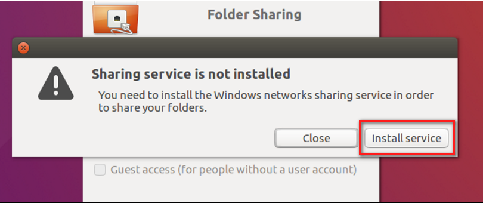
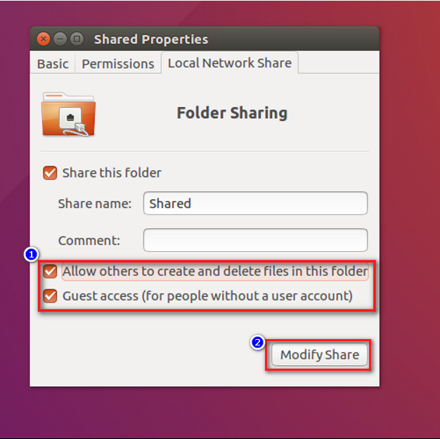
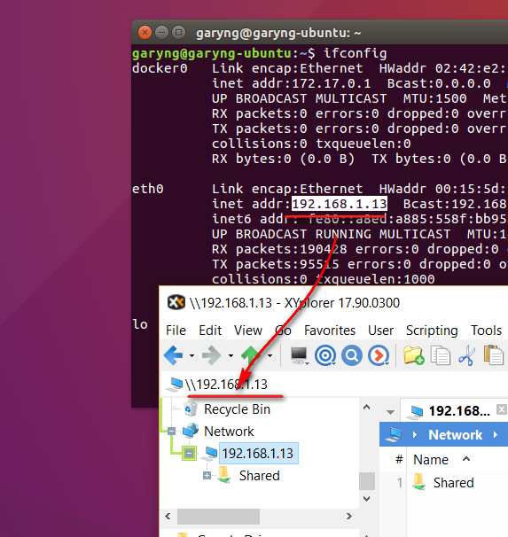
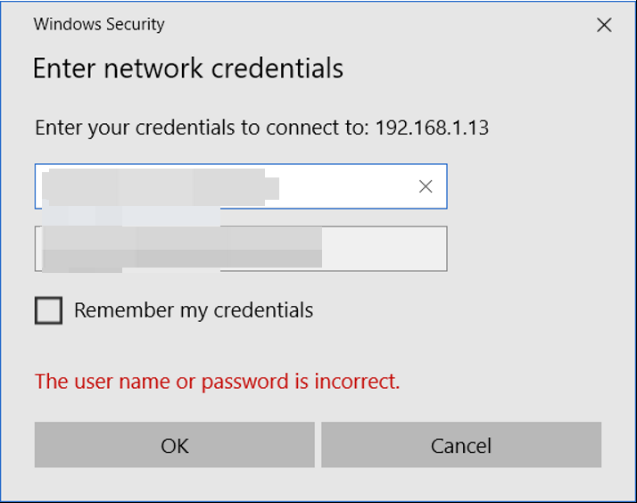

# Setting Up Samba on Ubuntu
## Solution
1. Create a new folder > Right Click > Properties > Local Network Share > Share this folder  

2. Install the services  

3. Check `Allow others to create and delete files in this folder`

### Accessing the Folder on Windows
1. Open File Explorer > Goto the IP address of the Ubuntu machine  

2. Enter the credentials if required  

## Reference
[Samba/SambaServerGuide](https://help.ubuntu.com/community/Samba/SambaServerGuide)

[Samba/SambaClientGuide](https://help.ubuntu.com/community/Samba/SambaClientGuide)
