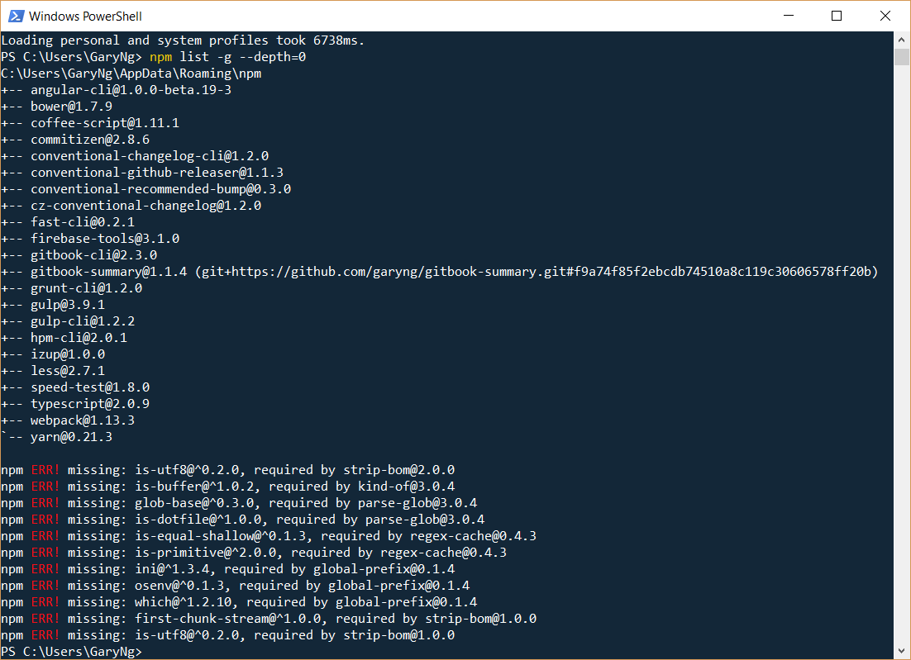

# npm List All Globally Installed Packages
## Solution
Use `npm list -g --depth=0`

## Reference
[Listing globally installed NPM packages and version](https://ponderingdeveloper.com/2013/09/03/listing-globally-installed-npm-packages-and-version/)
